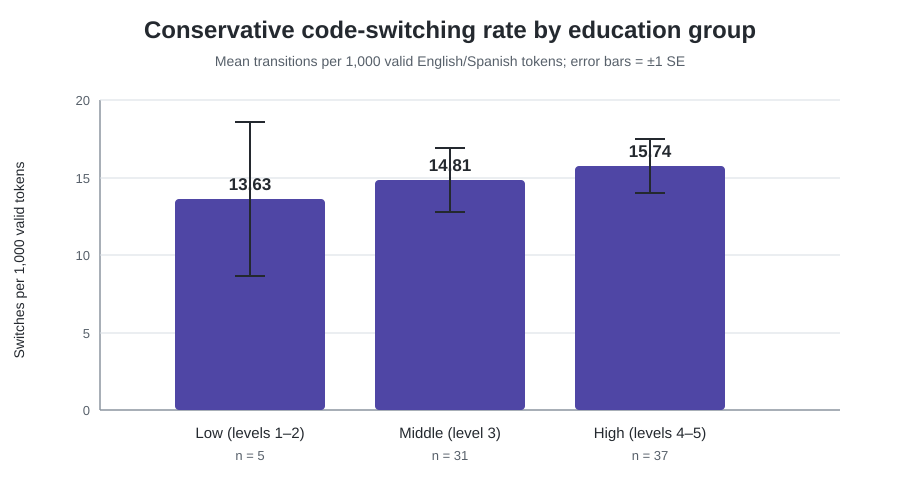

# Computational Analysis of Spanish-English Code-switching

[](https://www.python.org/)
[](https://github.com/shimeiyun/bangor-miami-code-switching/actions/workflows/tests.yml)
[](https://github.com/shimeiyun/bangor-miami-code-switching/releases/tag/v1.0.0)
[](http://bangortalk.org.uk/)

This portfolio turns naturally occurring Spanish-English conversation into a
reproducible computational-linguistics workflow. It parses CHAT headers, aligns
pseudonymised speakers with questionnaire metadata, reads heterogeneous
word-level TSV files, identifies conservative within-utterance transitions
from corpus-provided language annotations, and produces participant-level
rates.

The project was designed by Meiyun Shi, a multilingual linguistics student, to
demonstrate how linguistic questions can be operationalised as transparent
Python code.

## Research question

> Is educational level associated with conservative within-utterance
> Spanish-English code-switching frequency in the Bangor Miami Corpus?

The analysis uses a deliberately conservative primary definition:

- compare tokens only within the same recording, speaker, and utterance;
- count only adjacent `eng → spa` or `spa → eng` transitions;
- treat every other language label as a boundary;
- standardise by valid `eng + spa` tokens.

## Why this is a computational-linguistics portfolio

The main technical contribution is an auditable pipeline for messy bilingual
speech data:

1. parses CHAT participant and `@ID` tiers;
2. calculates age at recording from recording date and date of birth;
3. confirms mappings only with unique filename + age + sex evidence;
4. accommodates multiple TSV schemas by reading columns by name;
5. removes corpus footer records without deleting linguistic tokens;
6. handles ambiguous, mixed-morpheme, and non-word labels explicitly;
7. generates token-, recording-, and participant-level quality checks;
8. measures both valid tokens and eligible within-utterance adjacent pairs;
9. models switch counts with a log-exposure offset using Poisson and NB2
   quasi-likelihood regression;
10. retains Welch ANOVA, Kruskal-Wallis, ordinary ANOVA, and HC3 regression as
    transparent sensitivity analyses;
11. separates descriptive trends from inferential evidence.

## Verified full-corpus run

The private local run used source files downloaded from the Bangor Miami
Corpus. Raw corpus and questionnaire files are not redistributed here.

| Stage | Verified result |
|---|---:|
| CHAT files | 56 |
| TSV files | 56 |
| Analyzable TSV token rows | 316,600 |
| Strictly matched independent participants | 73 |
| Included token rows before language filtering | 236,782 |
| Valid `eng/spa` tokens | 195,864 |
| Conservative switch events | 2,980 |
| Overall pooled rate | 15.21 per 1,000 valid tokens |

Education-group means were 13.63 (Low, n=5), 14.81 (Middle, n=31), and
15.74 (High, n=37). Robust and non-parametric analyses found no reliable
evidence of a group difference. This null result is retained rather than
optimised away.



See the [aggregate full-corpus results](docs/FULL_CORPUS_RESULTS.md) for the
descriptive table, inferential checks, and responsible interpretation.

The complete portfolio paper is available in
[Word](report/Bangor_Miami_Computational_Analysis_Mini_Paper.docx) and
[PDF](report/Bangor_Miami_Computational_Analysis_Mini_Paper.pdf).

## Repository structure

```text
.
├── data/
│   ├── raw/                    # ignored; place licensed local files here
│   └── sample/                 # synthetic, redistributable fixture
├── notebooks/                  # guided portfolio walkthroughs
├── report/                     # five-page portfolio paper
├── src/bangor_miami/
│   ├── chat.py                 # CHAT-header parser
│   ├── metadata.py             # CSV/XLSX metadata reader
│   ├── mapping.py              # conservative speaker alignment
│   ├── tokens.py               # heterogeneous TSV reader
│   ├── switches.py             # annotated transition identifier
│   ├── analysis.py             # participant aggregation
│   ├── statistics.py           # count models and sensitivity analyses
│   ├── pipeline.py             # end-to-end orchestration
│   └── cli.py                  # command-line interface
├── tests/
├── DATA_DICTIONARY.md
└── pyproject.toml
```

## Quick start

The bundled synthetic demo requires only Python 3.10+:

```bash
python -m unittest discover -s tests -v
PYTHONPATH=src python -m bangor_miami demo --output-dir results/demo
```

On Windows PowerShell:

```powershell
$env:PYTHONPATH="src"
python -m unittest discover -s tests -v
python -m bangor_miami demo --output-dir results/demo
```

The demo produces mapping audits, switch events, recording and participant
rates, and descriptive summaries. With at least six participants, the same
pipeline also writes inferential tests, offset count models, an HC3 rate
regression, and a machine-readable statistical summary.

## Running with locally licensed corpus files

Reading the original questionnaire workbook requires the optional XLSX
dependency:

```bash
pip install -e ".[xlsx]"
```

Then run:

```bash
bangor-miami run \
  --chats-dir data/raw/miami_chats \
  --tsvs-dir data/raw/miami_tsvs \
  --metadata data/raw/metadata.xlsx \
  --output-dir results/full
```

## Reproducibility and non-guessing rules

A speaker mapping is confirmed only if exactly one questionnaire row has:

- the same normalised soundfile name;
- the same age at recording;
- the same normalised sex.

Filename-only and elimination-based matches remain unresolved. Unresolved
speakers never receive education data.

The education groups are a researcher-defined ordinal recoding:

- Low: levels 1–2
- Middle: level 3
- High: levels 4–5

The project does not claim that these labels are official definitions of the
five corpus codes.

## Testing

The eight tests cover CHAT extraction, conservative mapping, TSV footer
removal, switch-point identification and sequence resets, utterance boundaries,
end-to-end output, statistical probability bounds, and inferential output
schemas.

```bash
python -m unittest discover -s tests -v
```

## Ethics and data availability

The Bangor Miami Corpus has its own licence, citation requirements, and
TalkBank ethics conditions. This repository deliberately excludes raw corpus
audio, transcripts, questionnaire responses, and full token-level exports.
Users must obtain the source data from the official corpus provider and follow
its conditions of use.

The repository's MIT License applies to the original software and synthetic
fixtures created for this portfolio. It does not relicense the Bangor Miami
Corpus, its audio, transcripts, annotations, questionnaire data, or any other
third-party material. Those resources remain subject to the corpus provider's
licence, citation requirements, and TalkBank ethics conditions.

## Limitations

- strict mapping reduces the analyzable participant sample;
- the Low education group is very small;
- the primary metric captures conservative token transitions, not every
  linguistic definition of code-switching;
- the published full-corpus figures above predate the eligible-pair exposure
  metric and count models; those new results require a licensed local rerun;
- conversation topic, interlocutor relationship, and language proficiency are
  not yet modelled;
- the statistical result is associational, not causal.

## Suggested extensions

- add an independently reviewed speaker crosswalk;
- compare conservative and permissive switch definitions;
- add conversation- or recording-level clustering to the count models;
- analyse intra- and inter-sentential switching separately;
- add POS and clause-level predictors;
- evaluate switch-point prediction using speaker-disjoint cross-validation.

## Corpus citation

Deuchar, M., Davies, P., Herring, J., Parafita Couto, M. C., & Carter, D.
(2014). Building bilingual corpora. In *Advances in the Study of
Bilingualism* (pp. 93–111). Multilingual Matters.
